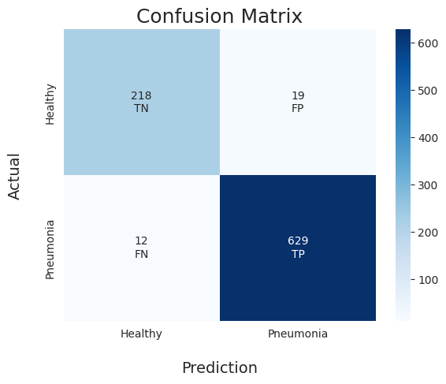

# Pneumonia iD - 
This repository is for the ML classifier software to identify Pneumonia cases in X-Ray lung scans.
Originally it was my Final Project for BSc Computer Science - University of London
Dataset source: https://www.kaggle.com/datasets/pcbreviglieri/pneumonia-xray-images

There are a few published papers and publicly available Jupyter-notebooks of Machine learning based models to detect Pneumonia cases from X-Ray scans, but all of them require at least some  knowledge of Python and command prompt. Additionally, they require the user to install multiple libraries before they can train the model which in itself takes hours. The goal of this project is to remove all these requirements and enable an average computer user to be able to detect possible Pneumonia cases. 

The Jupyter notebooks contain partial model training progress and code, along with the preprocessing done on the dataset.
shuffled_dataset.zip contains all the images the model was trained on, after they were resized and shuffled.

The compiled program available in Release section is a standalone software which can be run on any computer running Windows 7 or newer, enabling the user to classify any number of X-Ray scans within moments. There is no need for any additional library installation, configuration or model training.

## Features
- Single file program, exceptionally user-friendly and easy to use machine learning binary classifier.
- Option of using one of two built-in, pretrained models.
- One of the best performing publicly available pneumonia detection models, achieving 96.4% accuracy and 98.1% Recall.
- Ability to export predicted result and raw value scores to a CSV file.
- Lightweight model, capable of inferring hundreds of images in a few seconds.
- Option to open any of the input images directly from the results table.
 

## Requirements
    
    For running only the Python GUI tool to classify images:
        Python >=3.6
        PyTorch >= 2.2.0 (with Cuda and supported GPU for faster training, only CPU for inference/prediction)
        PySide6
        Scikit-learn
    
    
    For running the Jupyter notebooks to train the model and visualize evaluation metrics:
        Matplotlib
        Seaborn
        Jupyter-notebooks
        
    For compiling the Python GUI tool into a standalone executable:
        PyInstaller
        
    
## Compiling

The software can be compiled into an executable in Windows, Linux or Mac OSX environments, given the requirements above are fulfilled.

### Step 1: Generate PyInstaller .spec file
    
`pyi-makespec --noconsole --onefile --add-data="model;model" Main.py`

### Step 2: Modify the Main.spec file to include the following line, substituting the <...> part with the correct path
`hookspath=[("<Python installation path>/site-packages")]`
### Step 3: Compile with PyInstaller
`pyinstaller Main.spec`
This should create the executable in "dist" sub-directory

### Model Evaluation:

Evaluation on unseen testing set (878 images) for Classifier A:

| Evaluation Metric  | Value |
| ------------- | ------------- |
| Accuracy | 0.9579  |
| Reall  | 0.9875  |
| Precision  | 0.9562  |
| F1  |  0.9716  |

Evaluation on unseen testing set (878 images) for Classifier B:

| Evaluation Metric  | Value |
| ------------- | ------------- |
| Accuracy | 0.9647  |
| Reall  | 0.9813  |
| Precision  | 0.9707  |
| F1  |  0.9760  |

-- Confusion Matrix -- 

